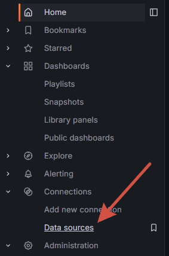
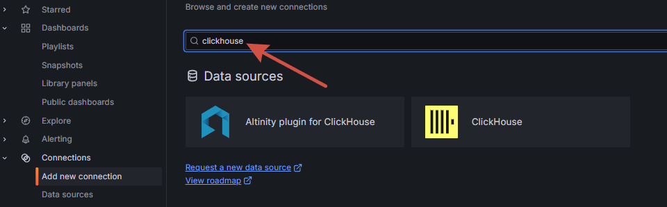
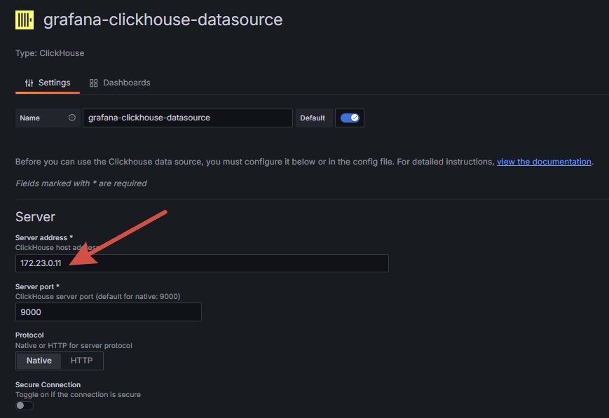
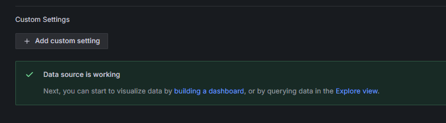

# Grafana

Default Grafana web-interface: [localhost:3000](http://localhost:3000)

## 1 Создание подключений 

### 1.1 Healthcheck

Убедитесь в healthcheck СУБД, к которым хотите сделать коннекты

```bash
docker ps
```
Получим подобный вывод
```bash
CONTAINER ID   IMAGE                                 COMMAND                  CREATED          STATUS                    PORTS                                                                                    NAMES
1b1f14435b4d   clickhouse/clickhouse-server:latest   "/entrypoint.sh"         50 seconds ago   Up 49 seconds (healthy)   127.0.0.1:8123->8123/tcp, 127.0.0.1:9000->9000/tcp, 127.0.0.1:9440->9440/tcp, 9009/tcp   kaboupi-clickhouse
35b8fa19bf1a   grafana/grafana-enterprise            "/run.sh"               50 seconds ago   Up 49 seconds             0.0.0.0:3000->3000/tcp                                                                   kaboupi-grafana
5335e994d3a2   minio/minio:latest                    "/usr/bin/docker-ent…"   50 seconds ago   Up 49 seconds             0.0.0.0:9001->9001/tcp, 0.0.0.0:9003->9000/tcp                                           kaboupi-minio
7c675c0e4928   postgres:13.3                         "docker-entrypoint.s…"   50 seconds ago   Up 49 seconds (healthy)   0.0.0.0:5432->5432/tcp                                                                   kaboupi-postgres
c1cab1693d48   zookeeper:3.7                         "/docker-entrypoint.…"   50 seconds ago   Up 49 seconds             2888/tcp, 3888/tcp, 8080/tcp, 0.0.0.0:22181->2181/tcp           
```
Необходимо, чтобы в колонке **STATUS** был `Up <time> (healthy)`

### 1.2 Data Sources

Логинимся в Grafana (kaboupi/kaboupi), переходим в **Data Sources** 

### 1.3 Создаём подключение

Для создания подключения необходимо выбрать формат драйвера: для этого в поиске ищем необходимый



##### Для ClickHouse

Открываем консоль и прописываем
```bash
docker inspect kaboupi-clickhouse
```

В самом низу будет ключ `"Networks"`:
```bash
...
"Networks": {
    "clickhouse-network": {
        "IPAMConfig": {
            "IPv4Address": "172.23.0.11"
        },
...
```

Копируем значение `"IPv4Address"`, подключаться будем именно к этому хосту



Создаём подключение, все флажки выключены



Радуемся подключению!

##### Для Postgres

Открываем консоль и прописываем
```bash
ipconfig
```

В самом первом блоке вывода будет строка `IPv4-адрес`:
```bash
Настройка протокола IP для Windows

Адаптер Ethernet Ethernet:
   ...
   IPv4-адрес. . . . . . . . . . . . : 192.168.0.160
   ...
...
```

Копируем значение `IPv4-адрес`, подключаться будем именно к этому хосту

Создаём подключение аналогично Clickhouse, все флажки выключены


Радуемся подключению!